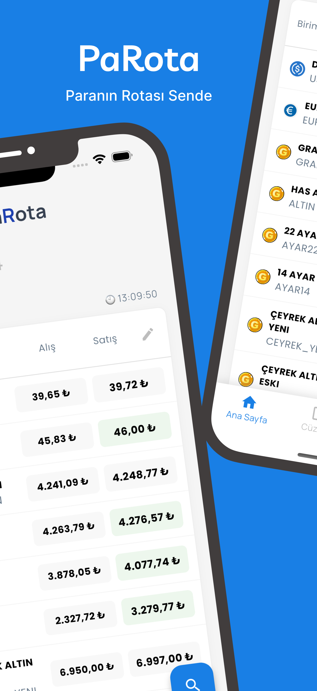
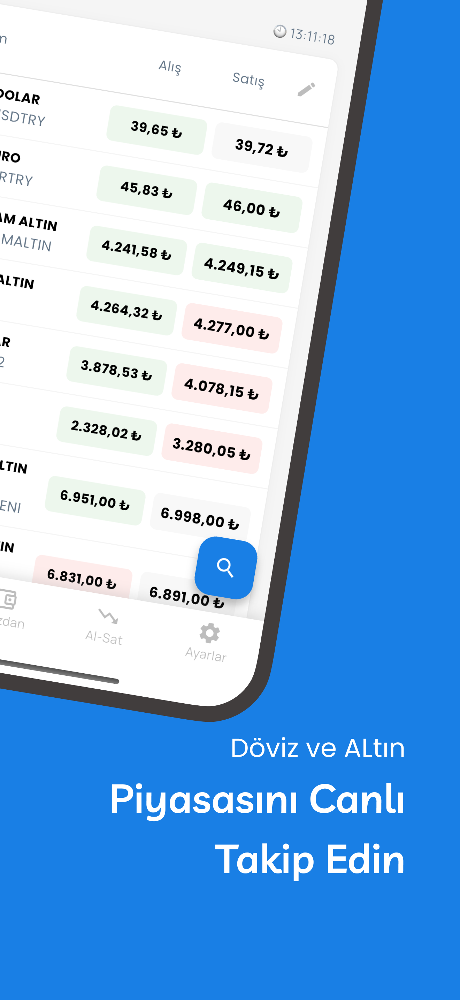
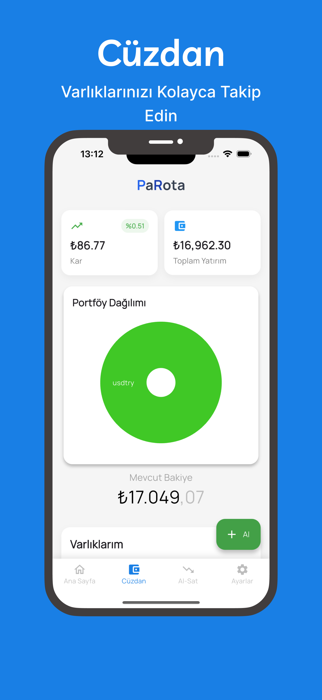
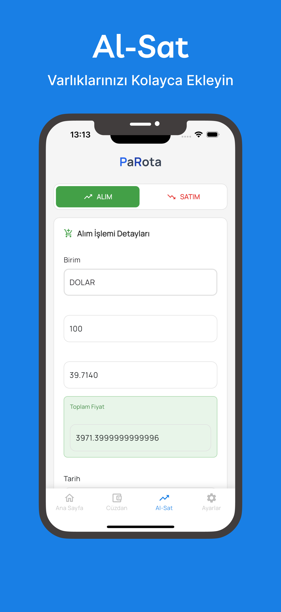
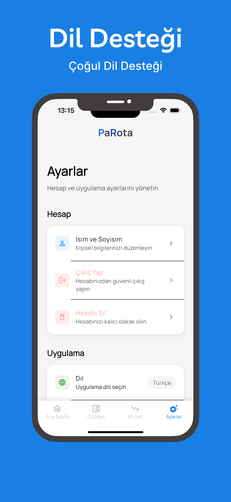

# 📱 PaRota - Altın & Döviz Takip Uygulaması


PaRota, gerçek zamanlı altın ve döviz kurlarını takip edebileceğiniz, portföy yönetimi yapabileceğiniz ve yatırım kararlarınızı destekleyecek modern bir mobil uygulamadır. Flutter ile geliştirilmiş olan uygulama, Clean Architecture ve Repository Pattern gibi modern yazılım geliştirme yaklaşımlarını benimser.

## 🚀 Mağaza Linkleri

<div align="center">

<a href="https://apps.apple.com/tr/app/parota-alt%C4%B1n-d%C3%B6viz/id6747687974">
  
</a>
<a href="https://play.google.com/store/apps/details?id=com.sakasstudio.parota">
  
</a>

</div>


## 📱 Uygulama Ekran Görüntüleri

<div align="center">

### Ana Ekran & Portföy Yönetimi




### Gerçek Zamanlı Fiyatlar & İşlem Geçmişi




</div>

> **Not**: Daha fazla ekran görüntüsü için [App Store](https://apps.apple.com/tr/app/parota-alt%C4%B1n-d%C3%B6viz/id6747687974) ve [Google Play](https://play.google.com/store/apps/details?id=com.sakasstudio.parota) sayfalarını ziyaret edebilirsiniz.

## ✨ Özellikler

### 📊 Gerçek Zamanlı Veri Takibi
- **Anlık Güncellemeler**: Altın fiyatları ve döviz kurları saniye saniye güncellenir
- **Canlı Veriler**: Piyasa hareketlerini kaçırmadan anlık değişimleri takip edin
- **Doğru Timing**: Gerçek zamanlı verilerle yatırım kararlarınızı optimize edin

### 💼 Portföy Yönetimi
- **Kolay Portföy Oluşturma**: Dakikalar içinde kişisel yatırım portföyünüzü oluşturun
- **Otomatik Hesaplama**: Toplam değerinizi anlık görüntüleyin
- **Kategori Bazında Görüntüleme**: Altın, döviz, kripto para kategorilerine göre ayrım
- **Diversifikasyon Takibi**: Her kategorinin portföydeki ağırlığını yüzde olarak görün

### 📈 İşlem Takibi
- **Al-Sat İşlem Kayıtları**: Tüm alım satım işlemlerinizi kaydedin
- **Kar-Zarar Hesaplama**: Otomatik kar-zarar hesaplamaları
- **Detaylı İşlem Geçmişi**: Geçmiş işlemlerinizi analiz edin
- **Performans Analizi**: Yatırım stratejinizi geliştirin

### 🎨 Kullanıcı Dostu Tasarım
- **Sade Arayüz**: Anlaşılır ve kullanımı kolay tasarım
- **Tek Ekran Erişim**: İhtiyacınız olan tüm bilgiler tek ekranda
- **Yaş Grubu Bağımsız**: Her yaştan kullanıcı için uygun tasarım

  
## 🏗️ Teknik Mimari

Bu proje modern yazılım geliştirme prensiplerini benimser:

### 📁 Proje Yapısı
```
lib/
├── core/                    # Uygulama temelleri
│   ├── configurations/      # Konfigürasyonlar
│   ├── helpers/            # Yardımcı fonksiyonlar
│   ├── mixins/             # Mixin'ler
│   ├── routing/            # Yönlendirme
│   └── widgets/            # Özel widget'lar
├── data/                   # Veri katmanı
│   ├── models/             # Veri modelleri
│   ├── repositories/       # Repository implementasyonları
│   └── services/           # Servis katmanı
├── domain/                 # İş mantığı katmanı
│   ├── entities/           # Domain varlıkları
│   └── use_cases/          # Kullanım senaryoları
├── env/                    # Çevre değişkenleri
└── presentation/           # Sunum katmanı
    ├── views/              # UI görünümleri
    └── view_models/        # Durum yönetimi
```

### 🔧 Kullanılan Teknolojiler
- **Framework**: Flutter
- **Mimari**: Clean Architecture
- **Pattern**: Repository Pattern
- **Platform**: iOS & Android
- **Dil**: Dart

### 📦 Minimum Gereksinimler
- **iOS**: 13.0 veya üzeri
- **Android**: API level 21 (Android 5.0) veya üzeri
- **Flutter**: 3.0.0 veya üzeri
- **Dart**: 2.17.0 veya üzeri

## 🛠️ Kurulum ve Çalıştırma

### Geliştirici Kurulumu

1. **Repository'yi klonlayın:**
   ```bash
   git clone https://github.com/enes-vural/asset-tracker.git
   cd asset-tracker
   ```

2. **Bağımlılıkları yükleyin:**
   ```bash
   flutter pub get
   ```

3. **Çevre değişkenlerini ayarlayın:**
   ```bash
   # env/ klasöründeki konfigürasyon dosyalarını düzenleyin
   ```

4. **Uygulamayı çalıştırın:**
   ```bash
   flutter run
   ```

### Debug Modu
```bash
flutter run --debug
```

### Release Modu
```bash
flutter run --release
```

## 🔐 Gizlilik ve Güvenlik

- **Kişisel Veriler**: Minimal veri toplama prensibi
- **Finansal Bilgiler**: Güvenli veri işleme
- **KVKK Uyumlu**: Türk mevzuatına uygun veri işleme
- **Gizlilik Politikası**: [Detaylı bilgi](https://sakasstudio.blogspot.com/2025/06/parota-gizlilik-sozlesmesi-tr.html)

## 🌟 Katkıda Bulunma

Bu projeye katkıda bulunmak istiyorsanız:

1. Fork yapın
2. Feature branch oluşturun (`git checkout -b feature/amazing-feature`)
3. Değişikliklerinizi commit edin (`git commit -m 'Add some amazing feature'`)
4. Branch'inizi push edin (`git push origin feature/amazing-feature`)
5. Pull Request oluşturun

### 📋 Katkı Kuralları
- Clean Code prensiplerini takip edin
- Unit testler yazın
- Kod dokumentasyonu ekleyin
- Flutter best practices'leri uygulayın

## 🐛 Hata Bildirimi

Bir hata ile karşılaştıysanız:
- [GitHub Issues](https://github.com/enes-vural/asset-tracker/issues) sayfasından bildirebilirsiniz
- Hata açıklaması, adımlar ve ekran görüntüleri ekleyin
- Cihaz ve versiyon bilgilerini belirtin

## 📞 İletişim

- **Geliştirici**: Enes Vural
- **Publisher**: Alper Vural (Sakas Studio)
- **Email**: İletişim bilgileri için mağaza sayfalarını kontrol edin

## 📄 Lisans

Bu proje telif hakları ile korunmaktadır.
© 2025 Alper Vural - Tüm hakları saklıdır.

## 🎯 Gelecek Planları

- [ ] Daha fazla finansal araç desteği
- [ ] Gelişmiş analiz araçları
- [X] Push notification özellikleri
- [X] Dark mode desteği
- [X] Multi-language support
- [ ] Widget desteği (iOS/Android)

---

<div align="center">

**PaRota ile akıllı yatırım yapın! 💎**

<a href="https://apps.apple.com/tr/app/parota-alt%C4%B1n-d%C3%B6viz/id6747687974">
  
</a>
<a href="https://play.google.com/store/apps/details?id=com.sakasstudio.parota">
  
</a>

</div>
